# Chronicle Pipeline Guide

This guide explains how Chronicle works from the outside in. It starts with the thousand-foot view, then walks down into the moving parts that turn raw AI/ML links into the public site, JSON feeds, daily archives, RSS, and Atom.

The intended reader is a new intern who knows basic TypeScript and web development, but has not worked on Chronicle before.

## 1. Thousand-Foot Overview

Chronicle is a static AI signal filter.

That means there is no production backend API server. A scheduled GitHub Actions workflow does the heavy work a few times per day, commits generated artifacts, and GitHub Pages serves the finished files.

At a high level:

1. Read the source registry.
2. Fetch RSS feeds, pages, GitHub data, Hacker News, Reddit, Hugging Face, YouTube, and other configured sources.
3. Normalize each fetched entry into a shared `RawItem` shape.
4. Split items into roles: main feed, repos, and learning.
5. Remove old items outside each role's time window.
6. Cluster duplicates and near-duplicates.
7. Classify items with deterministic rules and, for the main feed, LLM help when configured.
8. Score clusters using trust, novelty, quality, cluster size, recency, and engagement.
9. Apply diversity rules so one source family cannot dominate the feed.
10. Write static JSON, rendered HTML, archives, RSS, Atom, and schema files.

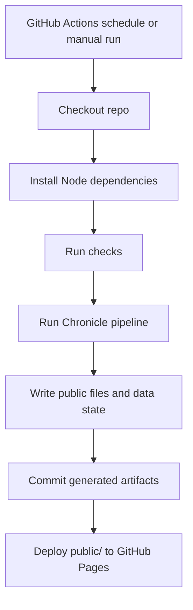

The public website is therefore the output of the pipeline, not a dynamic app that queries a server at request time.

## 2. The Mental Model

The easiest way to understand Chronicle is to think of it as three workers.

| Worker | Job | Main files |
| --- | --- | --- |
| Collector | Fetches and normalizes raw source data. | `src/sources/fetchers.ts`, `src/pipeline/canonicalize.ts`, `src/sources/registry.yaml` |
| Editor | Clusters, classifies, scores, and selects the best items. | `src/pipeline/cluster.ts`, `src/llm/classify.ts`, `src/pipeline/novelty.ts`, `src/pipeline/score.ts`, `src/pipeline/diversity.ts` |
| Publisher | Writes static files that users and feed readers consume. | `src/index.ts`, `src/render/static-site.ts`, `src/io/atomic.ts` |

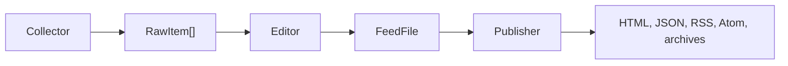

## 3. End-to-End Data Flow

This is the main pipeline as code sees it.

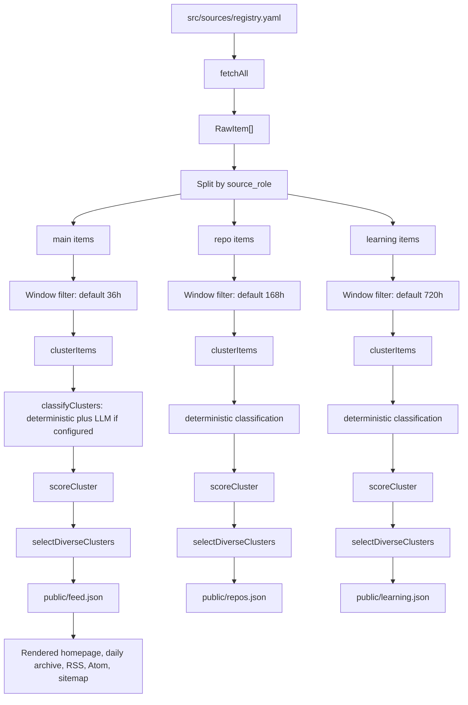

The same `buildRoleFeed` function handles the three roles. The inputs differ by role, and the main role gets extra LLM classification and Top News generation.

### Running Example Used Throughout

The examples below use fake data so the shapes are easy to follow without depending on a real news day.

Assume Chronicle sees this fictional story:

```text
AcmeAI released ToolGraph 1.2, a new API update that lets agent workflows stream tool calls while they run.
```

On the same morning, the story appears in several places:

| Source | What Chronicle sees |
| --- | --- |
| AcmeAI Blog | Original vendor announcement. |
| Engineering Weekly | Independent article about the same release. |
| Hacker News | Discussion thread linking to the AcmeAI post. |
| arXiv | A related paper about streaming tool-use graphs. |
| YouTube | A long-form tutorial showing how to build with ToolGraph. |

The point of the pipeline is to avoid showing all of that as a random pile of links. Chronicle should turn it into one useful main-feed cluster, maybe one learning item, and maybe one paper if the arXiv result is strong enough.

## 4. The Source Registry

The source registry is the pipeline's address book.

File:

```text
src/sources/registry.yaml
```

Each source entry tells Chronicle:

| Field | Meaning |
| --- | --- |
| `id` | Stable source identifier used in items, health, and source-family grouping. |
| `name` | Human readable source name. |
| `type` | Fetcher type, such as `rss`, `youtube_rss`, `hn_algolia`, `github_repo_search`, or `page_list`. |
| `url` | Feed or page URL when applicable. |
| `trust` | Source trust score used in ranking. |
| `source_role` | Which feed this source belongs to: `main`, `repo`, or `learning`. |
| `kind_hint` | Optional hint like `paper`, `video`, `course`, `repo_trending`, or `company_announcement`. |
| `ai_filter` | Whether to keep only AI-relevant items. |
| `limit` | Maximum items to take from that source in one run. |

The registry is the first place to look when a source is too noisy, too quiet, or assigned to the wrong feed.

Example tuning decisions:

| Goal | Usual change |
| --- | --- |
| Fetch fewer papers from arXiv | Lower the `limit` on each arXiv source. |
| Move a source out of the main feed | Change `source_role` to `learning` or `repo`, if appropriate. |
| Make a trusted source rank better | Increase `trust` carefully. |
| Remove non-AI noise | Enable or improve `ai_filter` and source-specific filters. |

### Source Registry Example

For the running example, the AcmeAI blog source might be configured like this:

```yaml
- id: acme_blog
  name: AcmeAI Blog
  type: rss
  url: https://acmeai.example/blog/rss.xml
  trust: 0.82
  source_role: main
  kind_hint: company_announcement
  ai_filter: true
  limit: 8
```

Read that as:

| Line | Meaning |
| --- | --- |
| `id: acme_blog` | Use `acme_blog` as the stable internal source ID. |
| `type: rss` | Use the RSS fetcher. |
| `trust: 0.82` | Treat this as a fairly trusted source, but not perfect. |
| `source_role: main` | Put matching items into the main feed candidate pool. |
| `kind_hint: company_announcement` | Start with the assumption that blog items are company announcements. |
| `ai_filter: true` | Drop items from this feed if they are not AI-related. |
| `limit: 8` | Take at most 8 items from this source in one run. |

If AcmeAI published 30 posts in a day, Chronicle would still only inspect the first 8 from this source because the registry says `limit: 8`.

## 5. Fetching: Turning Many Source Types Into One Shape

Chronicle supports multiple fetcher types, but they all produce the same internal type: `RawItem`.

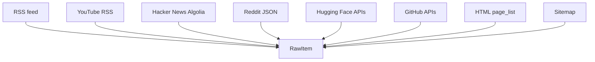

Important file:

```text
src/sources/fetchers.ts
```

Key fetcher types:

| Type | What it does |
| --- | --- |
| `rss` | Reads normal RSS/Atom feeds. |
| `youtube_rss` | Reads YouTube channel feeds and keeps instructional long-form videos. |
| `hn_algolia` | Reads Hacker News search results through Algolia. |
| `reddit` | Reads Reddit listing JSON. |
| `hf_papers` | Reads Hugging Face paper data. |
| `hf_models` | Reads Hugging Face model data. |
| `github_releases` | Reads releases from a specific GitHub repo. |
| `github_repo_search` | Finds trending repos using GitHub search. |
| `page_list` | Scrapes a configured list page with CSS selectors. |
| `sitemap` | Reads sitemap entries and inspects pages. |

The fetch layer also records source health. A source can fail without crashing the whole pipeline. Failed sources are reported in the generated feed metadata so the UI can show freshness and trust signals.

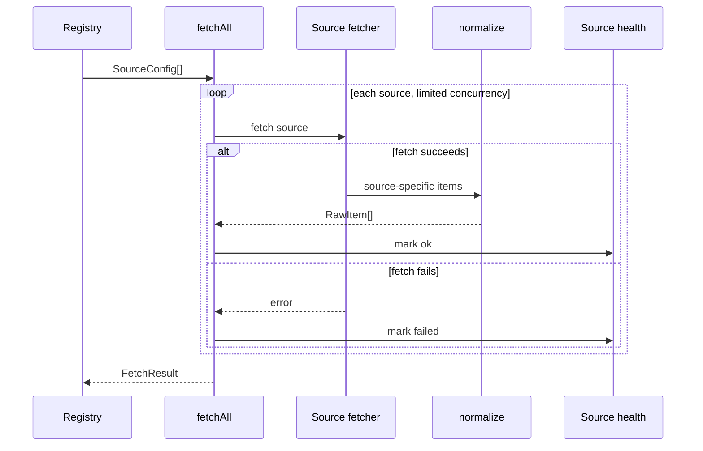

### Fetching Example

Suppose the AcmeAI RSS feed returns this entry:

```json
{
  "title": "ToolGraph 1.2 adds streaming tool calls for agent workflows",
  "link": "https://www.acmeai.example/blog/toolgraph-1-2?utm_source=rss&utm_campaign=launch#overview",
  "contentSnippet": "AcmeAI says ToolGraph 1.2 lets agents stream tool calls while a workflow is still running.",
  "isoDate": "2026-05-07T08:10:00.000Z"
}
```

The RSS fetcher does not keep this exact shape. RSS, Reddit, HN, GitHub, and YouTube all have different fields, so Chronicle immediately converts source-specific entries into a common shape.

The same fetch run might also produce source health like this:

```json
{
  "id": "acme_blog",
  "name": "AcmeAI Blog",
  "status": "ok",
  "fetched_count": 8,
  "fresh_count": 3,
  "stale_count": 5,
  "newest_published_at": "2026-05-07T08:10:00.000Z",
  "oldest_published_at": "2026-05-02T14:15:00.000Z"
}
```

That health object lets the final feed say, in effect, "AcmeAI Blog worked, and 3 of its fetched items were fresh enough to consider."

### YouTube Learning Filter

YouTube RSS is used for learning material, but not every video in a channel feed is useful. The YouTube fetcher rejects Shorts and keeps videos that look instructional or technical.

The filter rejects items that look like:

| Rejected pattern | Why |
| --- | --- |
| `/shorts/...` URLs | Shorts are usually not deep learning resources. |
| `#shorts` or "YouTube Shorts" text | Another Shorts signal. |
| Ads, launch teasers, brand campaigns | These are usually low learning value. |
| Videos without a stable `video_id` | Harder to de-duplicate and track. |

The learning feed is supposed to be useful study material, not a stream of social clips.

Example YouTube entries:

```json
[
  {
    "title": "Build an agent with ToolGraph 1.2 - full walkthrough",
    "url": "https://www.youtube.com/watch?v=abc123",
    "decision": "keep",
    "reason": "Long-form tutorial with practical implementation language."
  },
  {
    "title": "ToolGraph changed everything #shorts",
    "url": "https://www.youtube.com/shorts/xyz789",
    "decision": "drop",
    "reason": "Shorts URL and short-form hype phrasing."
  }
]
```

## 6. Normalization and Canonical URLs

Raw sources all look different. Normalization gives them one shared shape.

Core type:

```text
RawItem
```

Important fields:

| Field | Meaning |
| --- | --- |
| `id` | Stable hash derived from canonical URL. |
| `source_id` | Source registry ID. |
| `source_name` | Human source name. |
| `title` | Cleaned title. |
| `url` | Canonical URL. |
| `original_url` | Original URL before canonicalization, when different. |
| `summary` | Cleaned description or excerpt. |
| `published_at` | Best available publish date. |
| `date_confidence` | How confident Chronicle is in the date. |
| `kind_hint` | Optional source-provided kind hint. |
| `trust` | Trust inherited from the source. |
| `engagement` | Optional score, comments, stars, or similar signal. |

Canonicalization is important because the same story can appear with tracking parameters, AMP URLs, fragments, and alternate URL forms.

File:

```text
src/pipeline/canonicalize.ts
```

Canonicalization does things like:

| Input problem | Canonicalization behavior |
| --- | --- |
| `http://` or protocol-relative URLs | Normalizes to a stable HTTP(S) URL. |
| `www.` hostnames | Removes `www.`. |
| Tracking params | Drops `utm_*`, `fbclid`, `gclid`, and similar parameters. |
| URL fragments | Removes `#fragment`. |
| arXiv PDF links | Converts to the abstract page form. |
| Trailing slash noise | Removes unnecessary trailing slash. |

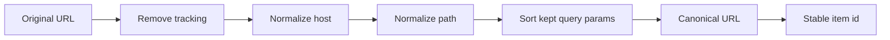

### Normalization Example

The RSS entry from AcmeAI becomes a `RawItem` like this:

```json
{
  "id": "19dbk9e",
  "source_id": "acme_blog",
  "source_name": "AcmeAI Blog",
  "source_role": "main",
  "trust": 0.82,
  "kind_hint": "company_announcement",
  "title": "ToolGraph 1.2 adds streaming tool calls for agent workflows",
  "url": "https://acmeai.example/blog/toolgraph-1-2",
  "original_url": "https://www.acmeai.example/blog/toolgraph-1-2?utm_source=rss&utm_campaign=launch#overview",
  "summary": "AcmeAI says ToolGraph 1.2 lets agents stream tool calls while a workflow is still running.",
  "published_at": "2026-05-07T08:10:00.000Z",
  "published_at_source": "feed",
  "date_confidence": "high"
}
```

The important conversion is:

| Before | After | Why it matters |
| --- | --- | --- |
| `link` | `url` and `original_url` | Chronicle keeps the original, but ranks and deduplicates with the canonical URL. |
| `contentSnippet` | `summary` | Every fetcher exposes description text through the same field. |
| `isoDate` | `published_at` | Every source uses an ISO timestamp in the same field. |
| Registry `trust` | `trust` | Ranking can use source trust without looking back at the registry. |
| Registry `kind_hint` | `kind_hint` | Classification starts with useful context. |

Canonical URL example:

```text
Before:
https://www.acmeai.example/blog/toolgraph-1-2?utm_source=rss&utm_campaign=launch#overview

After:
https://acmeai.example/blog/toolgraph-1-2
```

Now if Hacker News links to the clean URL and the RSS feed links to the tracking URL, Chronicle can still recognize that both point to the same story.

## 7. Role Split and Time Windows

After fetching, Chronicle splits items into three product surfaces.

| Role | Output | Default window | Purpose |
| --- | --- | --- | --- |
| `main` | `public/feed.json` | 36 hours | Daily AI/ML signal feed. |
| `repo` | `public/repos.json` | 168 hours | Repo radar and tool discovery. |
| `learning` | `public/learning.json` | 720 hours | Courses, videos, tutorials, and longer-lived learning material. |

File:

```text
src/index.ts
```

The longer windows for repos and learning are intentional. A useful repo or course can stay relevant longer than a news item.

If a source does not set `source_role`, Chronicle treats it as `main`.

### Role Split Example

Assume the fetchers produce these five normalized items:

| Title | Source role | Published at | Destination |
| --- | --- | --- | --- |
| ToolGraph 1.2 adds streaming tool calls | `main` | 2026-05-07 08:10 | Main feed candidate. |
| Engineering Weekly explains ToolGraph streaming | `main` | 2026-05-07 09:00 | Main feed candidate. |
| acme/toolgraph released v1.2.0 | `repo` | 2026-05-06 17:30 | Repo Radar candidate. |
| Build an agent with ToolGraph 1.2 | `learning` | 2026-04-28 10:00 | Learning feed candidate. |
| Old ToolGraph 1.0 launch post | `main` | 2026-04-01 12:00 | Dropped by the 36-hour main window. |

The main feed is intentionally short-lived. The learning video is older, but it can still survive because learning uses a longer window.

## 8. Clustering: Grouping Duplicate and Related Coverage

Clustering is where Chronicle starts becoming more than a link feed.

File:

```text
src/pipeline/cluster.ts
```

Input:

```text
RawItem[]
```

Output:

```text
Cluster[]
```

A cluster is a group of items that appear to cover the same story, claim, release, paper, tool, or discussion.

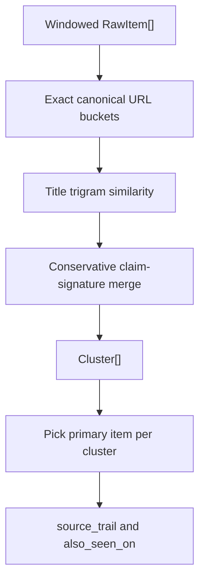

Chronicle clusters in stages:

| Stage | What it catches | Example |
| --- | --- | --- |
| Exact URL bucket | Same canonical URL from multiple sources. | Same blog post shared by RSS and HN. |
| Title trigram similarity | Near-identical titles. | "OpenAI releases X" vs "OpenAI has released X". |
| Claim signature merge | Paraphrased coverage with shared important tokens. | Vendor post plus article discussing the same model or API change. |

### What Is a Trigram?

A trigram is a three-character slice of text. For example, the title `agent` contains trigrams like `age`, `gen`, and `ent`.

Chronicle compares title trigram sets. If two titles share enough trigrams, they are probably about the same thing.

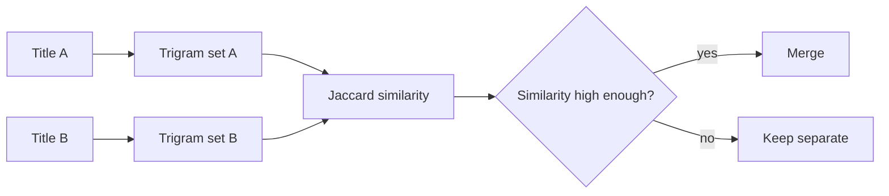

### Primary Item Selection

Every cluster needs one primary item to represent it.

Chronicle chooses the primary item by:

1. Higher source trust.
2. Higher engagement.
3. Earlier publish time.

The cluster still keeps the other sources in `members`, `source_trail`, and `also_seen_on`.

### Clustering Example

Before clustering, Chronicle might have three separate `RawItem`s:

```json
[
  {
    "id": "19dbk9e",
    "source_id": "acme_blog",
    "source_name": "AcmeAI Blog",
    "title": "ToolGraph 1.2 adds streaming tool calls for agent workflows",
    "url": "https://acmeai.example/blog/toolgraph-1-2",
    "trust": 0.82
  },
  {
    "id": "8zq2m1a",
    "source_id": "eng_weekly",
    "source_name": "Engineering Weekly",
    "title": "AcmeAI ToolGraph update brings streaming tool calls to agents",
    "url": "https://engineering-weekly.example/acme-toolgraph-streaming",
    "trust": 0.74
  },
  {
    "id": "4hn7c2p",
    "source_id": "hn_ai",
    "source_name": "Hacker News",
    "title": "AcmeAI launches ToolGraph 1.2",
    "url": "https://news.ycombinator.com/item?id=123456",
    "discussion_url": "https://news.ycombinator.com/item?id=123456",
    "trust": 0.62,
    "engagement": {
      "score": 184,
      "comments": 71
    }
  }
]
```

After clustering, those become one `Cluster`:

```json
{
  "id": "19dbk9e",
  "primary": {
    "id": "19dbk9e",
    "source_name": "AcmeAI Blog",
    "title": "ToolGraph 1.2 adds streaming tool calls for agent workflows",
    "url": "https://acmeai.example/blog/toolgraph-1-2",
    "trust": 0.82
  },
  "members": [
    { "id": "19dbk9e", "source_name": "AcmeAI Blog" },
    { "id": "8zq2m1a", "source_name": "Engineering Weekly" },
    { "id": "4hn7c2p", "source_name": "Hacker News" }
  ],
  "source_trail": [
    {
      "source_id": "acme_blog",
      "source_name": "AcmeAI Blog",
      "title": "ToolGraph 1.2 adds streaming tool calls for agent workflows",
      "url": "https://acmeai.example/blog/toolgraph-1-2",
      "published_at": "2026-05-07T08:10:00.000Z",
      "published_at_source": "feed",
      "date_confidence": "high"
    },
    {
      "source_id": "eng_weekly",
      "source_name": "Engineering Weekly",
      "title": "AcmeAI ToolGraph update brings streaming tool calls to agents",
      "url": "https://engineering-weekly.example/acme-toolgraph-streaming",
      "published_at": "2026-05-07T09:00:00.000Z",
      "published_at_source": "feed",
      "date_confidence": "high"
    },
    {
      "source_id": "hn_ai",
      "source_name": "Hacker News",
      "title": "AcmeAI launches ToolGraph 1.2",
      "url": "https://news.ycombinator.com/item?id=123456",
      "published_at": "2026-05-07T09:20:00.000Z",
      "published_at_source": "api",
      "date_confidence": "high",
      "discussion_url": "https://news.ycombinator.com/item?id=123456",
      "discussion_source": "Hacker News"
    }
  ],
  "also_seen_on": [
    {
      "source_name": "Engineering Weekly",
      "title": "AcmeAI ToolGraph update brings streaming tool calls to agents",
      "url": "https://engineering-weekly.example/acme-toolgraph-streaming",
      "published_at": "2026-05-07T09:00:00.000Z",
      "published_at_source": "feed",
      "date_confidence": "high"
    },
    {
      "source_name": "Hacker News",
      "title": "AcmeAI launches ToolGraph 1.2",
      "url": "https://news.ycombinator.com/item?id=123456",
      "published_at": "2026-05-07T09:20:00.000Z",
      "published_at_source": "api",
      "date_confidence": "high",
      "discussion_url": "https://news.ycombinator.com/item?id=123456",
      "discussion_source": "Hacker News"
    }
  ]
}
```

The user now sees one stronger story with evidence from several places instead of three scattered links.

## 9. Classification: Naming What Each Cluster Is

Classification gives each cluster useful labels.

Core outputs:

| Field | Meaning |
| --- | --- |
| `kind` | What type of item it is, such as `paper`, `tool`, `video`, `repo_trending`, or `company_announcement`. |
| `quality` | `signal`, `mixed`, or `hype`. |
| `one_liner` | Short explanation of the item. |

Files:

```text
src/llm/classify.ts
src/llm/providers.ts
```

Chronicle always starts with deterministic classification. For the main feed, it can then ask an LLM to improve labels and one-liners.

Repo and learning feeds intentionally skip LLM classification for now because their source roles and kind hints are usually enough.

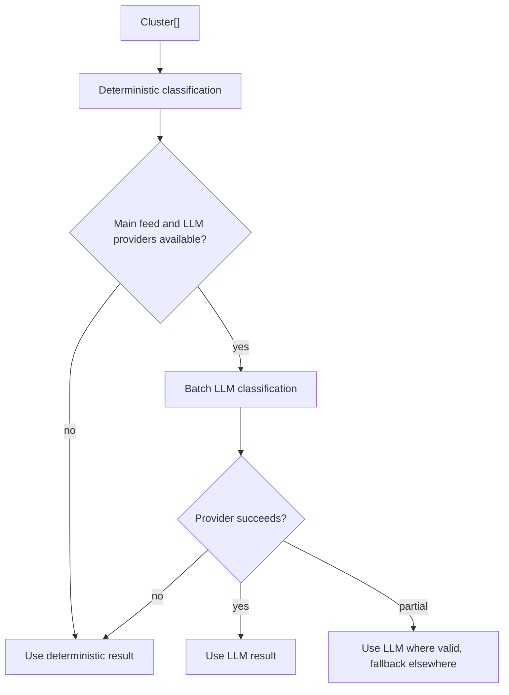

### LLM Provider Order

The provider order comes from environment variables.

Default order:

```text
Gemini -> Groq -> deterministic fallback
```

The provider layer handles:

| Concern | Behavior |
| --- | --- |
| Rate limits | Waits or switches providers when possible. |
| Blocked or empty responses | Falls back to the next provider. |
| Invalid JSON | Retries or uses deterministic fallback. |
| Missing API keys | Runs deterministic-only mode. |

The feed records the final classification mode, such as `llm`, `partial`, `fallback`, or `deterministic`.

### Classification Example

Before classification, Chronicle has a cluster but does not yet know how to describe it:

```json
{
  "id": "19dbk9e",
  "primary": {
    "title": "ToolGraph 1.2 adds streaming tool calls for agent workflows",
    "kind_hint": "company_announcement",
    "summary": "AcmeAI says ToolGraph 1.2 lets agents stream tool calls while a workflow is still running."
  },
  "members": [
    { "source_name": "AcmeAI Blog" },
    { "source_name": "Engineering Weekly" },
    { "source_name": "Hacker News" }
  ]
}
```

Deterministic classification might produce this:

```json
{
  "kind": "company_announcement",
  "quality": "mixed",
  "one_liner": "AcmeAI announced ToolGraph 1.2 with streaming tool-call support for agent workflows."
}
```

If an LLM provider is available, the main feed can get a cleaner classification:

```json
{
  "kind": "tool",
  "quality": "signal",
  "one_liner": "ToolGraph 1.2 adds streaming tool-call support that may change how teams build agent workflows."
}
```

That output is later merged into the `ScoredCluster`. If the LLM fails or returns invalid JSON, Chronicle keeps the deterministic version instead of failing the whole feed.

## 10. Novelty and History

Novelty answers a simple question:

```text
Have we seen something like this recently?
```

File:

```text
src/pipeline/novelty.ts
```

State file:

```text
data/history.json
```

Chronicle keeps recent cluster history, then compares today's titles against that history. If a title is very similar to recent history, the item is less novel. If it is unlike recent history, it is more novel.

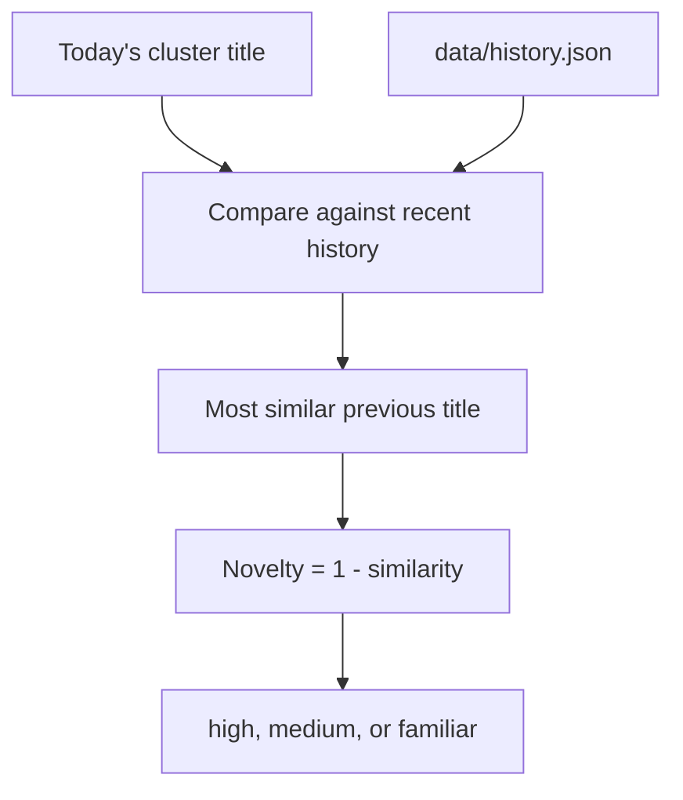

Same-day history is ignored during reruns. This prevents a manual rerun from making today's own items look stale.

After a successful main feed run, Chronicle appends selected clusters to history so future runs can detect repeated coverage.

### Novelty Example

Assume `data/history.json` contains these older titles:

```json
{
  "entries": [
    {
      "id": "old_001",
      "title": "AcmeAI previews ToolGraph streaming agents",
      "url": "https://example.com/old-toolgraph-preview",
      "date": "2026-04-29"
    },
    {
      "id": "old_002",
      "title": "VectorFlow adds database connectors for agent apps",
      "url": "https://example.com/vectorflow-connectors",
      "date": "2026-05-02"
    }
  ]
}
```

Today's title is:

```text
ToolGraph 1.2 adds streaming tool calls for agent workflows
```

Chronicle compares today's title with recent history. In a simplified example:

| Historical title | Similarity to today | Meaning |
| --- | ---: | --- |
| AcmeAI previews ToolGraph streaming agents | 0.44 | Related, but not identical. |
| VectorFlow adds database connectors for agent apps | 0.18 | Mostly unrelated. |

The maximum similarity is `0.44`, so novelty is approximately:

```text
1 - 0.44 = 0.56
```

That might become a `medium` novelty label. If there were no similar ToolGraph history, novelty might be closer to `0.90` and get a `high` label. If the same ToolGraph announcement had appeared yesterday, novelty might be closer to `0.15` and get a `familiar` label.

## 11. Scoring: Ranking by Signal, Not Just Recency

Scoring turns a classified cluster into a ranked item.

File:

```text
src/pipeline/score.ts
```

The score is a weighted blend.

| Component | Weight | Meaning |
| --- | ---: | --- |
| Novelty | 0.30 | New information should beat repeated coverage. |
| Quality | 0.25 | `signal` beats `mixed`, which beats `hype`. |
| Trust | 0.23 | Better sources rank higher. |
| Cluster size | 0.10 | Multiple sources can increase confidence. |
| Recency | 0.08 | Freshness matters, but should not dominate. |
| Engagement | 0.04 | Useful secondary signal from comments, scores, stars, etc. |

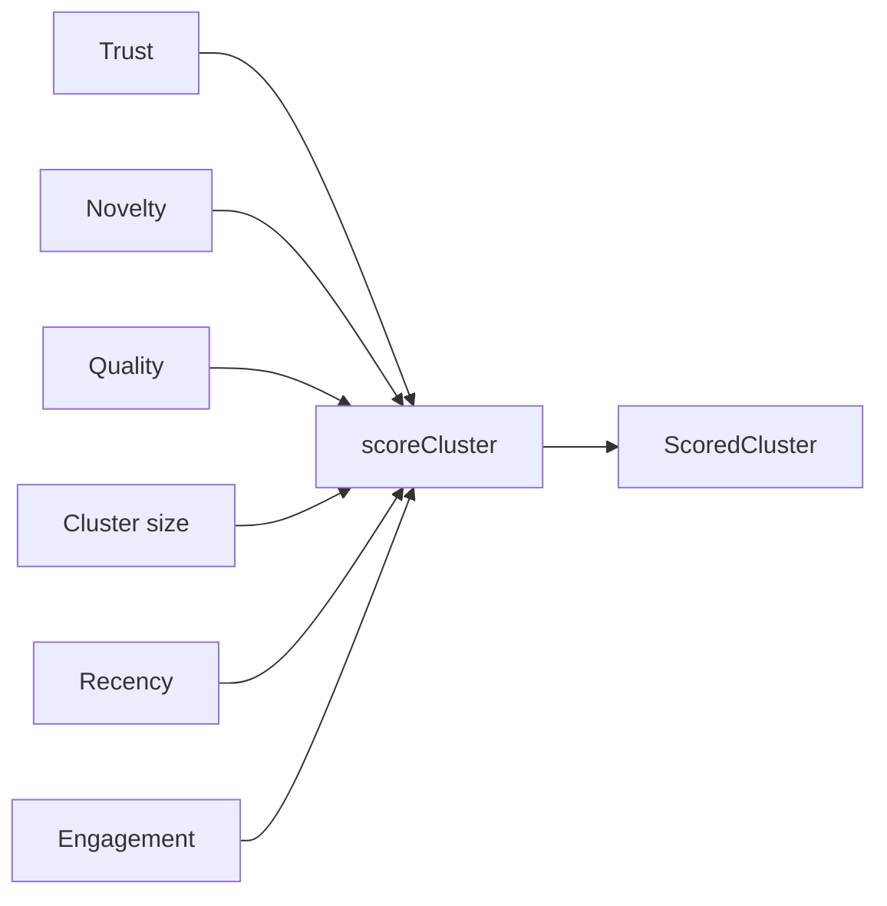

The scorer also adds user-facing explanations:

| Field | Purpose |
| --- | --- |
| `why_this_surfaced` | Explains why the item ranked. |
| `builder_action` | Gives a practical next step. |
| `novelty_label` | Converts numeric novelty into a readable label. |

### Penalties

Chronicle applies small penalties for common low-signal patterns.

| Pattern | Why it is penalized |
| --- | --- |
| Low-engagement single-source discussion | Reduces noisy forum-only items. |
| Low date confidence | Avoids over-trusting old or ambiguous dates. |
| Familiar mixed singleton | Pushes repeated low-confidence coverage down. |

### Scoring Example

For the ToolGraph cluster, assume Chronicle has these component values:

| Component | Example value | Why |
| --- | ---: | --- |
| Trust | 0.82 | Primary item is from AcmeAI Blog. |
| Novelty | 0.56 | Related to a previous preview, but the 1.2 release is new enough. |
| Quality | 1.00 | Classified as `signal`. |
| Cluster size | 0.58 | Three sources saw the same story. |
| Recency | 0.92 | Published recently. |
| Engagement | 0.55 | HN discussion has meaningful points and comments. |

Simplified score math:

```text
(0.82 * 0.23) +
(0.56 * 0.30) +
(1.00 * 0.25) +
(0.58 * 0.10) +
(0.92 * 0.08) +
(0.55 * 0.04)
= 0.76
```

The resulting `ScoredCluster` might include:

```json
{
  "id": "19dbk9e",
  "kind": "tool",
  "quality": "signal",
  "one_liner": "ToolGraph 1.2 adds streaming tool-call support that may change how teams build agent workflows.",
  "novelty": 0.56,
  "novelty_label": "medium",
  "trust": 0.82,
  "score": 0.76,
  "why_this_surfaced": [
    "High-trust source",
    "Multiple sources covered the same release",
    "Recent item with practical builder impact"
  ],
  "builder_action": "Review the API changes and decide whether streaming tool calls simplify your agent workflow."
}
```

## 12. Diversity: Preventing Source Takeovers

Even good sources can dominate a feed if Chronicle only sorts by raw score. Diversity selection prevents that.

File:

```text
src/pipeline/diversity.ts
src/pipeline/source-family-config.json
```

Diversity groups related sources into source families. For example, all `arxiv_*` sources belong to the arXiv family.

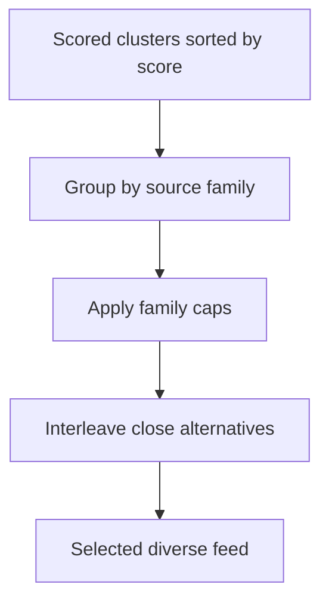

Important behavior:

| Rule | Purpose |
| --- | --- |
| Source family mapping | Treats related source IDs as one family. |
| Family caps | Prevents one family from consuming the list. |
| Exceptional overflow | Allows very high scoring items from most families to exceed the soft cap slightly. |
| arXiv hard cap | Keeps the whole selected list to at most 3 arXiv papers. |

There are two layers that control arXiv volume:

1. Fetch limits in `src/sources/registry.yaml` limit how many items each arXiv source can fetch.
2. The arXiv hard cap in diversity limits how many arXiv clusters can appear in the final selected list.

The first layer improves the candidate pool by fetching fewer papers up front. The second layer protects the final feed even if many arXiv candidates score well.

### Diversity Example

Assume raw scoring produces this top 10 list:

| Raw rank | Source family | Title | Score |
| ---: | --- | --- | ---: |
| 1 | arxiv | Streaming tool-use graphs for agents | 0.91 |
| 2 | arxiv | Tool invocation planning in LLM agents | 0.89 |
| 3 | arxiv | Reliable tool streaming with graph runtimes | 0.87 |
| 4 | arxiv | Benchmarking tool-call latency | 0.86 |
| 5 | acme | ToolGraph 1.2 adds streaming tool calls | 0.76 |
| 6 | github | acme/toolgraph v1.2.0 release | 0.74 |
| 7 | security | Agent tool permissions advisory | 0.72 |
| 8 | hn | Discussion: ToolGraph 1.2 | 0.69 |
| 9 | product | Competing API adds tool-call tracing | 0.67 |
| 10 | arxiv | Survey of agent orchestration patterns | 0.66 |

Without diversity, arXiv would take 5 of the top 10 slots. With the arXiv hard cap, Chronicle can keep at most 3 arXiv papers in the final selected list.

The selected list may become:

| Selected rank | Source family | Title |
| ---: | --- | --- |
| 1 | arxiv | Streaming tool-use graphs for agents |
| 2 | arxiv | Tool invocation planning in LLM agents |
| 3 | arxiv | Reliable tool streaming with graph runtimes |
| 4 | acme | ToolGraph 1.2 adds streaming tool calls |
| 5 | github | acme/toolgraph v1.2.0 release |
| 6 | security | Agent tool permissions advisory |
| 7 | hn | Discussion: ToolGraph 1.2 |
| 8 | product | Competing API adds tool-call tracing |

This is why source caps are not just cosmetic. They make room for different kinds of professional signal.

## 13. Top News Enrichment

Top News is the brief-like section above the full feed.

File:

```text
src/enrichment/top-news.ts
```

Top News tries to turn ranked links into a clearer daily brief. It selects high-value candidates, enriches them where possible, and writes a compact summary block into `feed.json`.

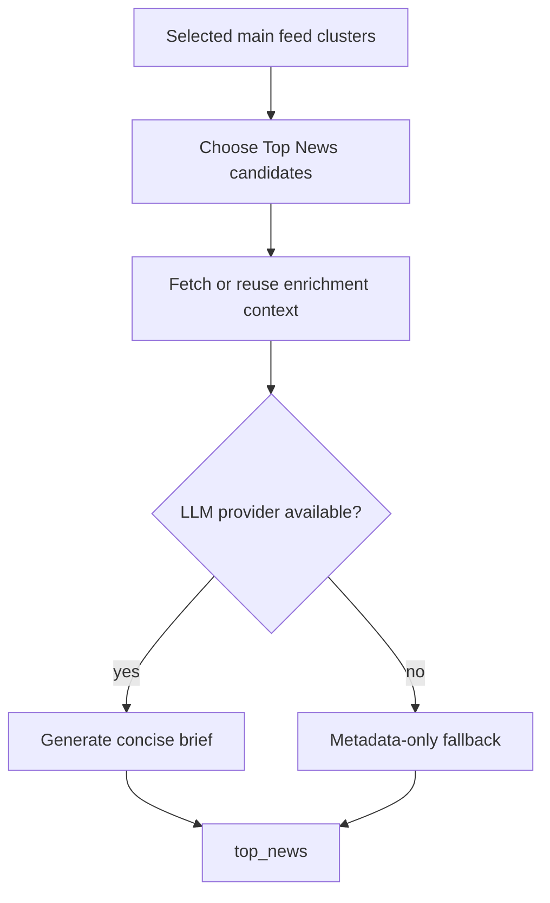

Top News is allowed to fail gracefully. If enrichment is unavailable, the main feed can still be generated.

### Top News Example

The full feed card might be detailed, but Top News needs a compact brief. For the ToolGraph cluster, `top_news` might contain:

```json
{
  "cluster_id": "19dbk9e",
  "title": "ToolGraph 1.2 adds streaming tool calls for agent workflows",
  "url": "https://acmeai.example/blog/toolgraph-1-2",
  "source_name": "AcmeAI Blog",
  "published_at": "2026-05-07T08:10:00.000Z",
  "kind": "tool",
  "score": 0.76,
  "dek": "AcmeAI's agent runtime update focuses on streaming tool calls instead of waiting for each call to finish.",
  "brief": "Builder relevance: teams with agent workflows can inspect whether streaming tool calls reduce latency or improve progress feedback. Treat it as an implementation change, not just a launch headline.",
  "enrichment_status": "ok",
  "enriched_at": "2026-05-07T09:35:00.000Z"
}
```

This is the same story, but rewritten for a quick daily brief.

## 14. Repo Radar

Repo Radar uses the same pipeline shape but has repo-specific state.

Output:

```text
public/repos.json
```

State:

```text
data/repo-history.json
```

Repo-specific logic tracks:

| Field | Meaning |
| --- | --- |
| `first_seen_at` | When Chronicle first noticed the repo. |
| `last_seen_at` | Most recent time Chronicle saw it. |
| `stargazers_count` | Current stars if available. |
| `stars_delta_30d` | Approximate momentum over the recent history window. |

Repo history helps Chronicle avoid treating the same old trending repo as new every run.

### Repo Radar Example

Assume GitHub search finds a fake repo:

```json
{
  "full_name": "acme/toolgraph",
  "html_url": "https://github.com/acme/toolgraph",
  "description": "Agent workflow runtime with streaming tool calls.",
  "language": "TypeScript",
  "stargazers_count": 12400,
  "forks_count": 830,
  "open_issues_count": 42,
  "pushed_at": "2026-05-07T07:55:00.000Z",
  "topics": ["agents", "tool-use", "workflow-runtime"]
}
```

Chronicle normalizes that into a repo `RawItem`:

```json
{
  "id": "repo_7n2a11",
  "source_id": "github_trending_agents",
  "source_name": "GitHub Trending Agents",
  "source_role": "repo",
  "kind_hint": "repo_trending",
  "title": "acme/toolgraph",
  "url": "https://github.com/acme/toolgraph",
  "summary": "Agent workflow runtime with streaming tool calls.",
  "published_at": "2026-05-07T07:55:00.000Z",
  "published_at_source": "api",
  "date_confidence": "high",
  "trust": 0.7,
  "repo": {
    "full_name": "acme/toolgraph",
    "html_url": "https://github.com/acme/toolgraph",
    "language": "TypeScript",
    "stargazers_count": 12400,
    "stars_delta_30d": 380
  }
}
```

If the same repo was already seen last month, repo history prevents Chronicle from treating it as a brand-new discovery unless its recent momentum is meaningful.

## 15. Learning Feed

The learning feed is designed for slower-moving educational resources.

Output:

```text
public/learning.json
```

Typical sources:

| Source type | Examples |
| --- | --- |
| `youtube_rss` | Technical videos, courses, tutorials. |
| `page_list` | Course pages or curated learning lists. |
| `rss` | Tutorial feeds. |

The learning window is longer because a good course or tutorial can remain valuable for weeks.

Chronicle filters learning items for instructional intent. The goal is to keep practical learning resources and avoid shorts, ads, teasers, and low-context promo clips.

### Learning Feed Example

A useful YouTube item might normalize into:

```json
{
  "id": "video_2r9kq4",
  "source_id": "youtube_ai_engineering",
  "source_name": "AI Engineering Channel",
  "source_role": "learning",
  "kind_hint": "video",
  "title": "Build an agent with ToolGraph 1.2 - full walkthrough",
  "url": "https://www.youtube.com/watch?v=abc123",
  "summary": "A 42-minute implementation walkthrough covering setup, streaming tool calls, retries, and debugging.",
  "published_at": "2026-04-28T10:00:00.000Z",
  "published_at_source": "feed",
  "date_confidence": "high",
  "trust": 0.64,
  "learning": {
    "provider": "YouTube",
    "channel_id": "UC-example",
    "video_id": "abc123",
    "level": "intermediate"
  }
}
```

A rejected Shorts item might look like this during filtering:

```json
{
  "title": "ToolGraph in 30 seconds #shorts",
  "url": "https://www.youtube.com/shorts/xyz789",
  "source_role": "learning",
  "kind_hint": "video",
  "decision": "drop",
  "reason": "Shorts are not kept as learning resources."
}
```

## 16. Publishing Outputs

Once Chronicle has selected clusters, it writes static files.

Main publisher files:

```text
src/index.ts
src/render/static-site.ts
src/io/atomic.ts
```

Generated outputs:

| Path | Purpose |
| --- | --- |
| `public/feed.json` | Main feed consumed by the frontend and external users. |
| `public/repos.json` | Repo Radar feed. |
| `public/learning.json` | Learning feed. |
| `public/index.html` | Statically rendered homepage with current content. |
| `public/daily/YYYY-MM-DD/feed.json` | Daily snapshot JSON. |
| `public/daily/YYYY-MM-DD/index.html` | Statically rendered daily archive page. |
| `public/daily/index.html` | Archive index page. |
| `public/rss.xml` | RSS feed. |
| `public/atom.xml` | Atom feed. |
| `public/feed.schema.json` | JSON schema for feed consumers and CI verification. |
| `public/sitemap.xml` | Search engine sitemap. |
| `public/robots.txt` | Crawl policy and sitemap pointer. |
| `data/history.json` | Main novelty history. |
| `data/repo-history.json` | Repo Radar history. |
| `data/enrichments.json` | Cached enrichment context. |

Writes use atomic helpers where practical so a partial write is less likely to leave broken JSON behind.

### Feed Output Example

The final `public/feed.json` wraps selected clusters with metadata. This example is trimmed to keep the shape readable:

```json
{
  "generated_at": "2026-05-07T09:40:00.000Z",
  "last_successful_generated_at": "2026-05-07T09:40:00.000Z",
  "refresh_status": "partial",
  "classification_mode": "llm",
  "window_hours": 36,
  "source_total": 58,
  "source_ok": 57,
  "source_failed": 1,
  "failed_sources": [
    {
      "id": "example_slow_feed",
      "name": "Example Slow Feed",
      "message": "Fetch timed out"
    }
  ],
  "source_health": [
    {
      "id": "acme_blog",
      "name": "AcmeAI Blog",
      "status": "ok",
      "fetched_count": 8,
      "fresh_count": 3
    },
    {
      "id": "example_slow_feed",
      "name": "Example Slow Feed",
      "status": "failed",
      "fetched_count": 0,
      "message": "Fetch timed out"
    }
  ],
  "count": 60,
  "top_news": [
    {
      "cluster_id": "19dbk9e",
      "title": "ToolGraph 1.2 adds streaming tool calls for agent workflows",
      "url": "https://acmeai.example/blog/toolgraph-1-2",
      "source_name": "AcmeAI Blog",
      "published_at": "2026-05-07T08:10:00.000Z",
      "kind": "tool",
      "score": 0.76,
      "dek": "AcmeAI's agent runtime update focuses on streaming tool calls.",
      "brief": "Builder relevance: inspect whether streaming tool calls reduce latency in agent workflows.",
      "enrichment_status": "ok",
      "enriched_at": "2026-05-07T09:35:00.000Z"
    }
  ],
  "clusters": [
    {
      "id": "19dbk9e",
      "kind": "tool",
      "quality": "signal",
      "score": 0.76,
      "primary": {
        "source_name": "AcmeAI Blog",
        "title": "ToolGraph 1.2 adds streaming tool calls for agent workflows",
        "url": "https://acmeai.example/blog/toolgraph-1-2"
      }
    }
  ]
}
```

That file is what the frontend can enhance, and what external users can inspect directly.

## 17. Static Rendering

Chronicle does not only ship JSON. It also renders the current feed into HTML.

File:

```text
src/render/static-site.ts
```

Why this matters:

| Benefit | Explanation |
| --- | --- |
| SEO | Crawlers can see actual feed content in HTML. |
| No-JS resilience | Users still see the brief and feed if JavaScript fails. |
| Perceived speed | Main content is in the initial document. |
| Sharing | Archive pages and metadata are stable. |

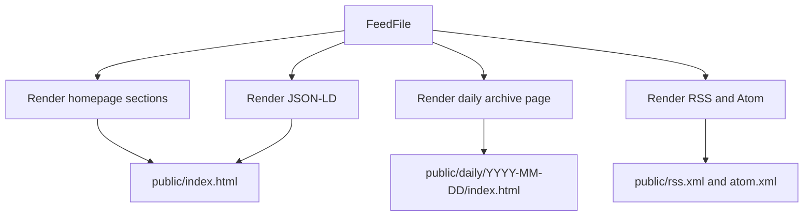

The renderer uses assertive replacements. If required markers or template shapes are missing, rendering throws instead of silently shipping stale metadata or missing content.

### Static Rendering Example

The same ToolGraph cluster can become HTML like this:

```html
<article class="card" data-kind="tool" data-source="AcmeAI Blog">
  <p class="eyebrow">Tool - medium novelty - score 0.76</p>
  <h2>
    <a href="https://acmeai.example/blog/toolgraph-1-2">
      ToolGraph 1.2 adds streaming tool calls for agent workflows
    </a>
  </h2>
  <p>
    ToolGraph 1.2 adds streaming tool-call support that may change how teams
    build agent workflows.
  </p>
  <ul>
    <li>High-trust source</li>
    <li>Multiple sources covered the same release</li>
    <li>Recent item with practical builder impact</li>
  </ul>
</article>
```

A crawler, feed preview tool, or no-JS browser can read that directly from `public/index.html`. JavaScript can still enhance filtering and interactions later.

## 18. Frontend Enhancement

The browser starts from the static HTML and progressively enhances it.

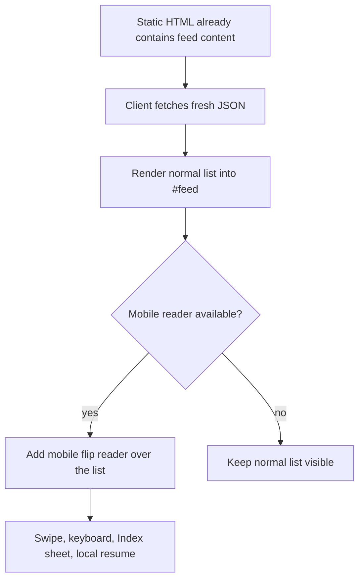

The order matters. Chronicle always renders the normal list before adding the mobile reader. If the reader code fails, if Pointer Events are unavailable, if JavaScript is disabled, or if JSON cannot be fetched, the user still has the regular list or the original static HTML.

The list and the mobile reader use separate localStorage records:

| Key | Used by | Shape |
| --- | --- | --- |
| `chronicle-progress:{day}` | Desktop and list reading progress. | `{ "y": 1200, "index": 7, "ts": 1778500000000 }` |
| `chronicle-reader:v1:{day}:{tab}:{filterSignature}` | Mobile flip reader progress. | `{ "itemKey": "url:https://example.com/a", "index": 7, "ts": 1778500000000 }` |

The mobile key includes the day, tab, and filter signature so Signal, Repos, Learning, archives, and filtered views do not fight over one saved position. The reader stores a stable item key first and index second; after filters change, Chronicle tries to keep the same item, then falls back to the nearest valid index.

Gesture handling is shared with pull-to-refresh. The first small movement decides ownership:

| Movement | Owner |
| --- | --- |
| Downward swipe on the first reader card | Pull-to-refresh. |
| Upward or downward reader navigation | Mobile reader. |
| Mostly horizontal movement | Cancel so links and browser gestures stay predictable. |

The reader respects `prefers-reduced-motion`. In that mode the same navigation works, but the page-fold animation collapses to near-instant opacity and transform changes.

When changing inline shell behavior in `public/index.html` or adding a shell script such as `public/mobile-reader-state.js`, bump `CACHE_VERSION` in `public/sw.js`. The service worker serves navigations network-first, but the shell cache is still versioned, so this bump prevents old app shells from lingering across PWA sessions.

## 19. Failure Handling

Chronicle is built to degrade instead of collapsing when one dependency fails.

| Failure | Behavior |
| --- | --- |
| One source fails | Mark source failed, continue with other sources. |
| All sources fail or no clusters | Preserve previous feed when possible and mark status. |
| LLM provider rate limits | Wait or try another provider. |
| LLM output is invalid | Fall back to deterministic classification. |
| Top News enrichment fails | Use fallback summaries or continue without blocking the feed. |
| Archive prune looks unsafe | Skip destructive deletion when safeguards trigger. |
| Render template markers missing | Throw so CI or workflow catches it. |

The general rule is:

```text
Missing optional enrichment should not stop the feed.
Broken core artifacts should fail loudly.
```

### Failure Example

Assume 58 sources are configured. During one run:

| Source | Result |
| --- | --- |
| AcmeAI Blog | OK, 3 fresh items. |
| Engineering Weekly | OK, 2 fresh items. |
| Hacker News | OK, 12 fresh items. |
| Example Slow Feed | Failed with timeout. |

The feed can still be published with this metadata:

```json
{
  "refresh_status": "partial",
  "source_total": 58,
  "source_ok": 57,
  "source_failed": 1,
  "failed_sources": [
    {
      "id": "example_slow_feed",
      "name": "Example Slow Feed",
      "message": "Fetch timed out"
    }
  ]
}
```

That is better than failing the entire daily brief because one source was slow.

Now assume the renderer cannot find the required static marker in `public/index.html`. That is different. The generated HTML might be broken, so Chronicle should fail the workflow loudly instead of quietly deploying stale content.

## 20. GitHub Actions Workflow

The workflow is the production scheduler.

Main jobs:

1. Install dependencies.
2. Run TypeScript and feed verification checks.
3. Execute the pipeline with configured API keys.
4. Commit generated artifacts back to the branch.
5. Deploy `public/` to GitHub Pages.

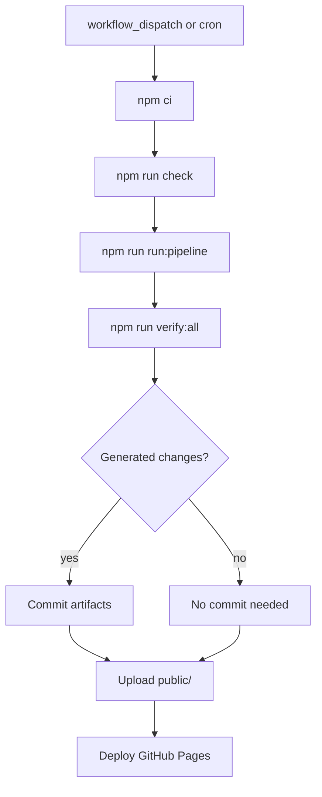

The README documents the refresh schedule as:

```text
05:17, 12:17, and 18:17 UTC
```

Manual workflow runs follow the same path as scheduled runs.

### Workflow Example

For a successful manual run on 2026-05-07, the workflow might do this:

```text
09:40:00  npm ci
09:40:21  npm run check
09:40:38  npm run run:pipeline
09:43:12  npm run verify:all
09:43:18  git status shows generated changes
09:43:19  commit public/feed.json, public/index.html, public/rss.xml, data/history.json
09:43:25  upload public/ as the Pages artifact
09:43:40  deploy GitHub Pages
```

The user only sees the finished static site. The heavy work happened before deployment.

## 21. How To Debug The Pipeline

Start with these commands:

```bash
npm run check
npm run run:pipeline
npm run verify:all
```

Useful files to inspect after a run:

| File | What to check |
| --- | --- |
| `public/feed.json` | Main feed status, counts, clusters, source health. |
| `public/repos.json` | Repo feed quality and stale repo suppression. |
| `public/learning.json` | Learning items and YouTube/course filtering. |
| `data/history.json` | Whether novelty history is updating. |
| `data/repo-history.json` | Whether repo history is tracking stars and first seen dates. |
| `public/daily/index.json` | Archive index health. |

Log prefixes to watch:

| Prefix | Meaning |
| --- | --- |
| `[fetch]` | Source fetching and source-level errors. |
| `[window:*]` | Time-window filtering by role. |
| `[cluster:*]` | Cluster counts and clustering behavior. |
| `[score:*]` | Scoring counts and selected items. |
| `[diversity:*]` | Source family mix after selection. |
| `[top-news]` | Top News enrichment. |
| `[write]` | Artifact writes. |

For a quick feed count check:

```bash
node -e 'const f=require("./public/feed.json"); console.log(f.refresh_status, f.count, f.source_ok + "/" + f.source_total);'
```

For a quick source count check:

```bash
node -e 'const f=require("./public/feed.json"); const m={}; for (const c of f.clusters) { const s=c.primary.source_id; m[s]=(m[s]||0)+1; } console.log(m);'
```

Example output:

```text
{
  acme_blog: 2,
  eng_weekly: 3,
  hn_ai: 5,
  arxiv_cl: 2,
  arxiv_lg: 1
}
```

If the arXiv total is higher than expected, inspect both `src/sources/registry.yaml` fetch limits and `src/pipeline/diversity.ts` source-family caps.

## 22. Where To Change Things

| Goal | File |
| --- | --- |
| Add or tune sources | `src/sources/registry.yaml` |
| Change URL cleanup | `src/pipeline/canonicalize.ts` |
| Change duplicate detection | `src/pipeline/cluster.ts` |
| Change classification behavior | `src/llm/classify.ts` |
| Change LLM provider behavior | `src/llm/providers.ts` |
| Change novelty history | `src/pipeline/novelty.ts` |
| Change ranking weights | `src/pipeline/score.ts` |
| Change source caps or diversity | `src/pipeline/diversity.ts` and `src/pipeline/source-family-config.json` |
| Change Top News | `src/enrichment/top-news.ts` |
| Change generated HTML/RSS/Atom | `src/render/static-site.ts` |
| Change mobile reader UI | `public/index.html` and `public/mobile-reader-state.js` |
| Change service worker shell caching | `public/sw.js` |
| Change pipeline orchestration | `src/index.ts` |
| Change workflow schedule/deploy | `.github/workflows/update-feed.yml` |

### Change Example

If the feed shows too many arXiv papers, do not start in the renderer. Start where the candidates are created and selected:

1. Check `src/sources/registry.yaml` to see how many papers each arXiv source fetches.
2. Check `src/pipeline/source-family-config.json` to confirm every `arxiv_*` source maps to the `arxiv` family.
3. Check `src/pipeline/diversity.ts` to confirm the final selected feed enforces the arXiv family cap.
4. Run the pipeline and inspect `public/feed.json` source counts.

If YouTube Shorts appear in learning, start in `src/sources/fetchers.ts` because that is where YouTube RSS entries are filtered before they become learning feed candidates.

## 23. Common Product Questions

### Why Not Just Sort By Date?

Because repeated AI coverage is noisy. A story can appear many times across blogs, social feeds, papers, and discussion sites. Chronicle tries to reward new, trustworthy, useful signal instead of recency alone.

### Why Keep History?

History lets Chronicle detect repeated coverage. Without history, the same narrative can look new every time a different source posts it.

### Why Cluster Before Scoring?

If five sources cover the same thing, the user should see one stronger cluster instead of five separate cards. Clustering reduces scanning work and lets Chronicle show corroboration.

### Why Use Diversity Caps?

Some source families are high volume. arXiv is the clearest example. Without caps, one high-volume source can crowd out product changes, infrastructure updates, security news, and practical tooling.

### Why Static Render HTML If JSON Exists?

Static rendering makes the site useful to crawlers, feed previews, and no-JS users. JSON is still useful for client-side enhancement, but the core content should be visible in HTML.

## 24. Glossary

| Term | Meaning |
| --- | --- |
| `SourceConfig` | One configured source from `registry.yaml`. |
| `RawItem` | One normalized fetched item. |
| `Cluster` | A group of duplicate or related `RawItem`s. |
| `ScoredCluster` | A cluster after classification, novelty, scoring, and explanation fields are added. |
| `FeedFile` | The JSON object written to `feed.json`, `repos.json`, or `learning.json`. |
| `source_role` | Which product surface a source belongs to: main, repo, or learning. |
| Source family | A group of related source IDs used for diversity caps. |
| Novelty | How different an item is from recent Chronicle history. |
| Quality | A label for signal level: `signal`, `mixed`, or `hype`. |
| Classification mode | Whether labels came from LLM, partial LLM, fallback, or deterministic rules. |
| Source health | Per-source fetch status included in output metadata. |
| Daily archive | Permanent dated snapshot of the main feed. |

## 25. One-Page Summary

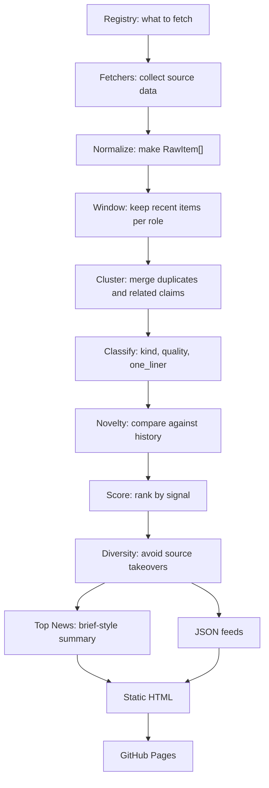

If you remember only one sentence, remember this:

Chronicle is a scheduled static pipeline that fetches many AI/ML sources, normalizes them into one shape, clusters repeated coverage, scores for novelty and usefulness, limits source domination, and publishes the result as fast static files.
